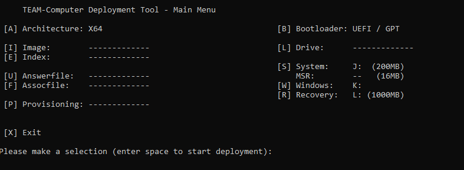

<h1 align="center">
   
  TEAM-Deploy - A crude Windows deployment tool
   
</h1>

<h4 align="center">
  TEAM-Deploy is a simple tool to replace the Windows Setup written entirely in Batch. It's designed for rapid deployment of Windows in environments such as repair shops.
</h4>

  

## 💾 Setup

To start using TEAM-Deploy clone or download the repository and populate the `Images` folder with your WIM or ESD files, the `Answerfiles` folder with your <a href="https://learn.microsoft.com/en-us/windows-hardware/customize/desktop/wsim/answer-files-overview">Answerfiles</a>, `Associationfiles` folder with your <a href="https://learn.microsoft.com/en-us/windows-hardware/manufacture/desktop/export-or-import-default-application-associations">Associationfiles</a> and the `Packages` folder with your <a href="https://learn.microsoft.com/en-us/windows-hardware/manufacture/desktop/siloed-provisioning-packages">Siloed provisioning packages</a>.

Note that no path should contain spaces, that includes the path to the repository itself aswell as the names of the image, answerfile, associationfile, and provisioning package files.

Not all versions of DISM support applying Siloed provisioning packages. If you want to use provisioning packages you should use the latest version of DISM from the Windows ADK and set the `adkLocation` option in the `TEAM-Deploy.cfg` file to the location of the ADK installation.

## 📋 Usage

Execute `TEAM-Deploy.cmd` with administrative privileges and use the menu to select the disk, image, answerfile, association file and provisioning package to be used. The script will then format the disk, write the partition table, copy the image to the disk and apply the answerfile, association file and provisioning package. Finally it will create the bootloader.

Partitioning, imaging, answerfile deployment, association file deployment and provisioning package deployment can all be enabled/disabled independently.

## 📝 Configuration

The `TEAM-Deploy.cfg` file contains the configuration for TEAM-Deploy. The following options are available:
* `bootType` - The boot type of the system. Valid values are `UEFI` and `BIOS` (when booted from PE will be overwritten with the current PE boot type).
* `partitionTable` - The partition table type to be written. Valid values are `GPT` and `MBR`. Choose `GPT` for UEFI systems and `MBR` for BIOS systems (when booted from PE will be overwritten with the partition table type fitting to the boot type).
* `sizeSystem` - The size of the system partition in MB. The default value is `200`.
* `sizeRecovery` - The size of the recovery partition in MB. The default value is `1000`.
* `sizeMSR` - The size of the MSR partition in MB. The default value is `16`.
* `letterSystem` - The letter of the boot partition. The default value is `J`.
* `letterOS` - The letter of the Windows partition. The default value is `K`.
* `letterRecovery` - The letter of the recovery partition. The default value is `L`.
* `arch` - The architecture of the system. Valid values are `X86` and `X64`.
* `diskID` - The index of the disk to be used for the deployment. The default value is `X` for no selection.
* `imageID` - The index of the image to be deployed. The default value is `1` for the first image (alphabetically sorted) in the `Images\<Arch>` folder.
* `imageIndex` - The index within the image to be deployed. The default value is `1` for the first index in the selected image (for stock Microsoft images that typically is the Home edition).
* `answerID` - The index of the answerfile to be used. The default value is `1` for the first answerfile (alphabetically sorted) in the `Answerfiles\<Arch>` folder.
* `assocID` - The index of the association file to be used. The default value is `1` for the first association file (alphabetically sorted) in the `Associationfiles\<Arch>` folder.
* `packageID` - The index of the provisioning package to be used. The default value is `1` for the first provisioning package (alphabetically sorted) in the `Packages\<Arch>` folder.
* `adkLocation` - The location of the ADK installation. The default value is `X:\ADK`. Will be ignored if not found.

## 💵 Credits

Thanks to SelfMan for some of the english translations.